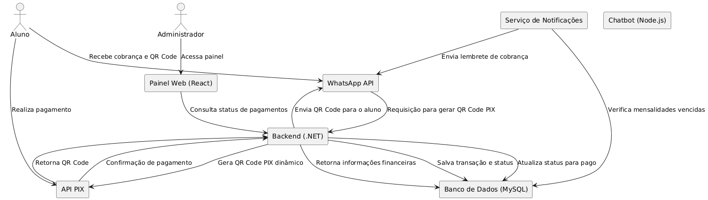

# 📌 PIX Bot – Automação de Cobranças via WhatsApp  

Este projeto automatiza a cobrança de mensalidades utilizando **PIX** e **WhatsApp**, eliminando a necessidade de verificações manuais. Ele foi criado para um grupo de jovens que precisa gerenciar pagamentos recorrentes de forma eficiente.  

<div align="center">
  
</div>

---

## ✨ Features  

✅ **Cobrança Automática Mensal**  
   - No primeiro dia do mês, o bot envia uma mensagem única e automática via WhatsApp para cada aluno ou responsável financeiro.  

✅ **Painel Web para Administradores**  
   - Controle total sobre os alunos cadastrados.  
   - **CRUD completo** para gerenciamento direto no sistema.  

✅ **Geração de QR Code PIX**  
   - O sistema gera um QR Code PIX dinâmico para cada pagamento.  

✅ **Confirmação Automática de Pagamento**  
   - Assim que o pagamento for identificado, o sistema atualiza automaticamente o status no banco de dados.  

---

## 🛠️ Tecnologias Utilizadas  

- **Backend:** `.NET 9 C#` com **Web API**  
- **Banco de Dados:** `MySQL`  
- **Integrações:** `WhatsApp API`, `Chatbots`, `Stripe`  
- **ORM:** `Entity Framework Core 9`  

---

## 🚀 Como Rodar o Projeto  

### **1️⃣ Pré-requisitos**  
Antes de começar, certifique-se de ter:  
- .NET 9 instalado  
- MySQL instalado e configurado  
- API do WhatsApp configurada  

### **2️⃣ Instalação**  

Clone o repositório e entre na pasta do projeto:  
```bash
git clone https://github.com/seu-usuario/pix-bot-mensalidade.git
cd pix-bot-mensalidade
